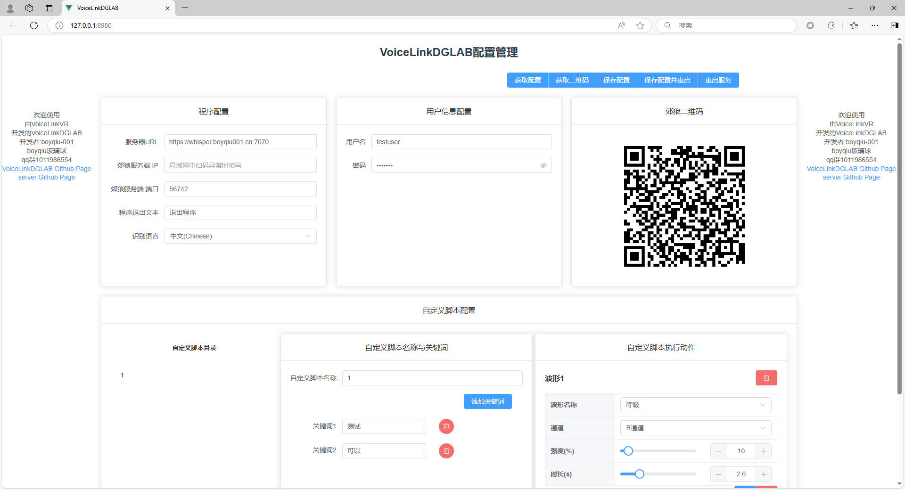

# VoiceLinkDGLAB
这是一个使用VoiceLinkVR server作为后端语音识别，并触发郊狼 (DG-LAB) 3.0 设备的控制程序。

- 兼容设备：通过 WebSocket 控制 DG-LAB APP，目前只适配 DG-LAB 3.0 主机。


## 注意事项
1. 本程序及开发者不对使用该本程序产生的任何后果负责，使用程序则视为同意本条款。
2. 请遵循 DG-LAB APP 中的说明，以安全的方式使用设备，使用此程序前请根据个人情况设置合理的强度上限。


## 快速开始

### 打包文件启动

如没有python环境可以访问通过[下载链接](https://github.com/VoiceLinkVR/VoiceLinkDGLAB/releases)或者QQ群1011986554群文件下载打包后的程序

解压压缩包后双击VoiceLinkDGLAB.exe 

打开后会默认启动edge或默认浏览器

界面如下



### python 启动
```
pip install -r requirements.txt

python main.py
```


## 常见问题

### 1. 麦克风无法收音
请检查系统默认麦克风

### 2. 如何将游戏内声音送入程序
可以使用voicemeeter 等虚拟声卡，将自己的话筒与系统声音同时输入虚拟麦克风
